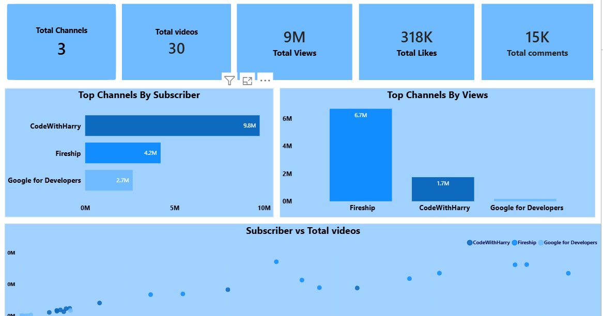
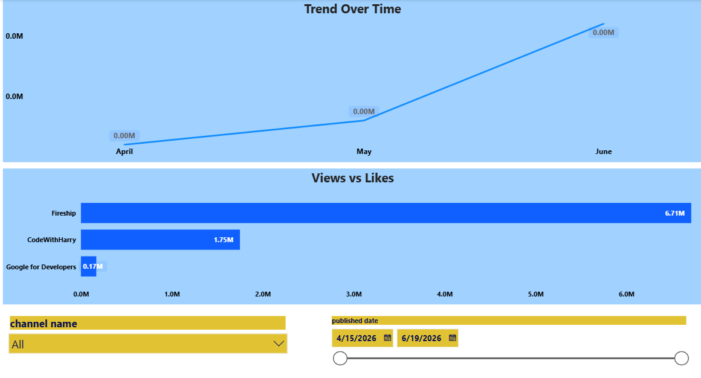
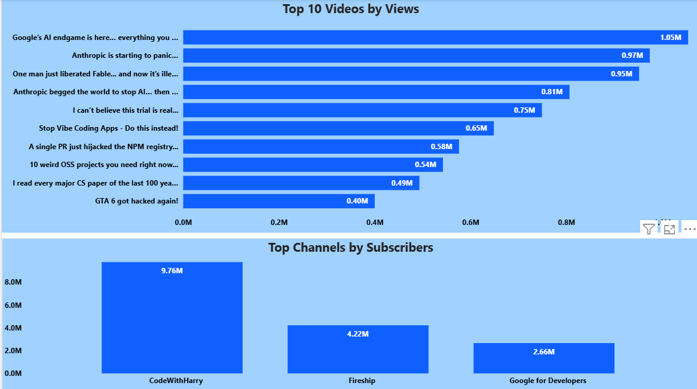

# 🎥 YouTube Data Engineering Project

<p align="center">
  
  
  
  
</p>

---

# 📌 Project Overview

This project is an end-to-end **Data Engineering Pipeline** built completely on **Linux (Arch Linux)**.

The pipeline extracts YouTube channel and video data using the **YouTube Data API v3**, stores raw data in PostgreSQL, transforms it into a dimensional warehouse model, and finally visualizes business insights through interactive Power BI dashboards.

The project follows a modern ETL architecture:

**Extract → Load → Transform → Analyze**

---

# 🏗️ Architecture

```text
YouTube API
     │
     ▼
Python Extraction Scripts
     │
     ▼
Raw Layer (PostgreSQL)
     │
     ▼
Staging Layer
     │
     ▼
Warehouse Layer (Star Schema)
     │
     ▼
Power BI Dashboard
```

---

# 🚀 Tech Stack

| Tool | Purpose |
|------|---------|
| Python | Data Extraction & ETL |
| YouTube API | Data Source |
| Pandas | Data Processing |
| PostgreSQL | Data Warehouse |
| SQLAlchemy | Database Connection |
| SQL | Transformations |
| Power BI | Dashboard & Analytics |
| Git/GitHub | Version Control |
| VS Code | Development Environment |
| Arch Linux | Operating System |

---

# 📂 Project Structure

```text
youtube_de_project/
│
├── raw/                        # Raw CSV files
│
├── scripts/                   # Python ETL scripts
│   ├── extract.py
│   ├── load_raw.py
│   ├── load_videos.py
│   └── transform.py
│
├── sql/
│   ├── raw_sql/
│   ├── staging_sql/
│   └── warehouse_sql/
|
|__ config/    # API KEY 
│
├── dashboards/
│   └── youtube_dashboard.pbix
│
├── images/
│   ├── dashboard_overview.png
│   ├── channel_analytics.png
│   └── top_videos_chart.png
│
├── requirements.txt
└── README.md
```

---

# 📥 Data Extracted

## Channel Information

- Channel ID
- Channel Name
- Channel Created Date
- Subscribers
- Total Views
- Total Videos

## Video Information

- Video ID
- Channel ID
- Video Title
- Published Date
- Views
- Likes
- Comments

---

# 🗄️ Data Warehouse Design

## Raw Layer

Stores data exactly as received from the API.

Tables:

- `raw.raw_channels`
- `raw.raw_videos`

## Staging Layer

Cleans and standardizes raw data.

Tables:

- `staging.stg_channels`
- `staging.stg_videos`

## Warehouse Layer

Implements a Star Schema.

Dimension Tables:

- `warehouse.dim_channels`
- `warehouse.dim_videos`

Fact Table:

- `warehouse.fact_video_metrics`

---

# 📊 Dashboard Features

✅ Total Subscribers KPI

✅ Total Views KPI

✅ Total Likes KPI

✅ Top 10 Videos by Views

✅ Top Channels by Subscribers

✅ Upload Trend Analysis

✅ Likes vs Views Analysis

✅ Channel-wise Performance

✅ Interactive Filters

---

# 🖥️ Dashboard Preview

<h2 align="center">📈 Complete Dashboard Overview</h2>

<p align="center">
  
</p>

---

<h2 align="center">📊 Channel Analytics Dashboard</h2>

<p align="center">
  
</p>

---

<h2 align="center">🏆 Top Videos Analysis</h2>

<p align="center">
  
</p>

---

# ⚙️ How to Run

## Clone Repository

```bash
git clone https://github.com/bhuvnesh5911/youtube_de_project.git
cd youtube_de_project
```

## Create Virtual Environment

```bash
python -m venv .venv
source .venv/bin/activate
```

## Install Dependencies

```bash
pip install -r requirements.txt
```

## Run Extraction

```bash
python scripts/extract.py
```

## Load Raw Data

```bash
python scripts/load_raw.py
python scripts/load_videos.py
```

## Run Transformations

```bash
python scripts/transform.py
```

---

# 📈 Future Improvements

- Apache Airflow Integration
- Docker Containerization
- Incremental Data Loading
- Data Quality Checks
- CI/CD Pipeline using GitHub Actions
- Cloud Deployment (AWS/GCP)

---

# 🎯 Key Learnings

- REST API Integration
- ETL Pipeline Development
- Data Warehousing
- Star Schema Modeling
- SQL Transformations
- PostgreSQL Administration
- Power BI Dashboarding
- Linux-based Development
- Git & GitHub Workflow

---

# 👨‍💻 Author

## Bhagwan

**Aspiring Data Engineer**

<p align="center">
⭐ If you found this project useful, consider giving it a star!
</p>